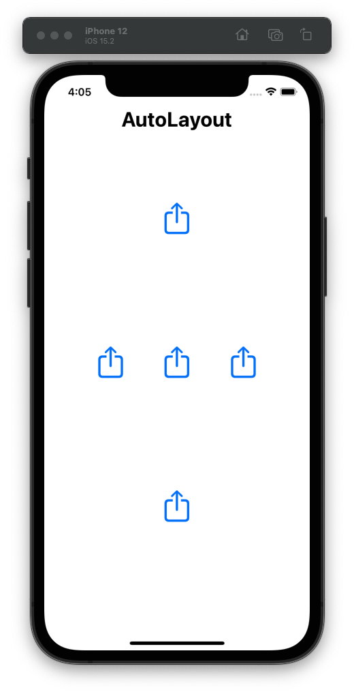

## Week 02 - AutoLayout

### AutoLayout
기기마다 다른 화면 크기를 가지고 있기 때문에, 특정 픽셀 크기 등으로 사이즈를 정의하거나 정렬하는 경우 레이아웃이 맞지 않게 될 수 있다.  
AutoLayout은 뷰마다 Constraint를 설정해주면, 이 제약 조건에 맞게 추론해서 뷰를 보여준다.  

### 실습
#### Constraints

| 	 | 	 | 	 |
| :-- | :-- | :-- |
| 	 | <ul><li>**a**</li><li>a.centerX=centerX</li><li>a.centerY=0.5*centerY</li></ul>	 | 	 |
| <ul><li>**b**</li><li>b.centerX=0.5*centerX</li><li>b.centerY=centerY</li></ul>	 | <ul><li>**c**</li><li>c.centerX=centerX</li><li>c.centerY=centerY</li></ul>	 | <ul><li>**d**</li><li>d.centerX=1.5*centerX</li><li>d.centerY=centerY</li></ul>	 |
| 	 | <ul><li>**e**</li><li>e.centerX=centerX</li><li>e.centerY=1.5*centerY</li></ul>	 | 	 |

#### 실습 결과

</img>

