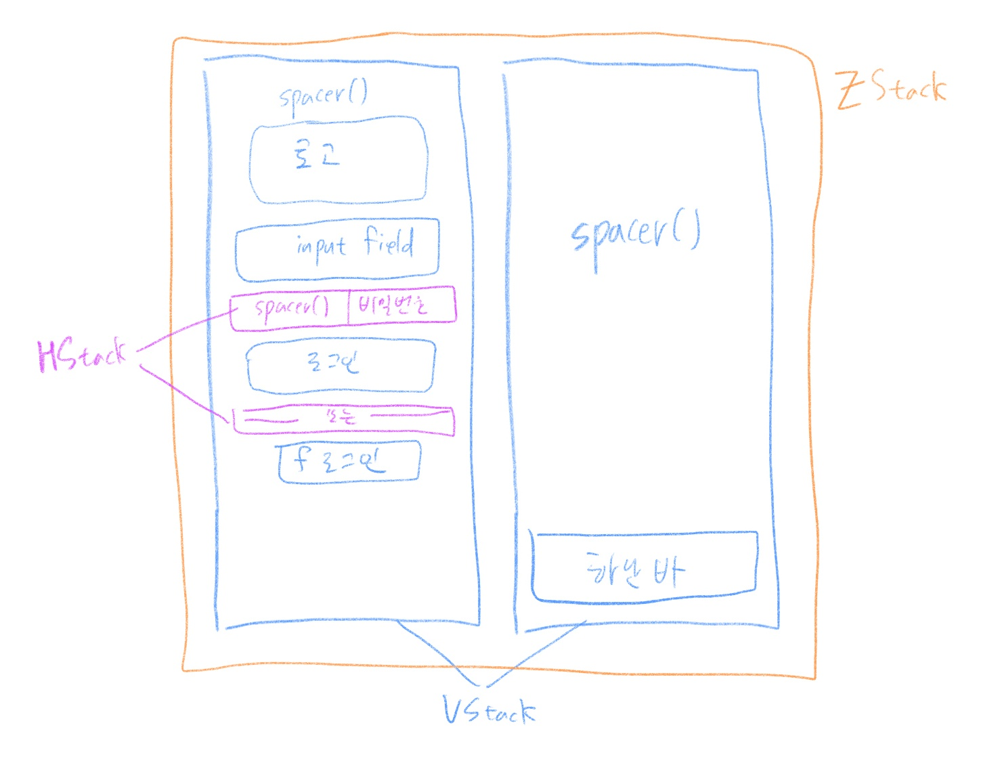
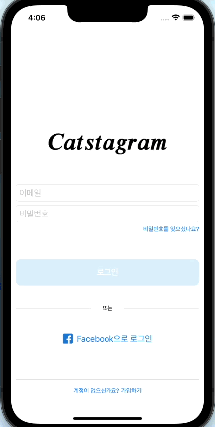

## Week 03 - 로그인, 회원가입 화면 구성 및 기능 구현

### SwiftUI
#### 선언적 구문
SwiftUI는 선언적 구문을 사용한다. 따라서 사용자 인터페이스의 기능을 명시하면 뷰를 바로 생성할 수 있다. 코드가 간결하고 가독성이 향상되어 시간이 절약되고 유지 관리가 용이하다.

### 실습
#### 뷰 구성

<p align="center">
</img>
</p>

로그인 화면을 임의로 구성해 보았다.  
기본적으로 뷰들이 위에서 부터 시작하여 `VStack`을 사용하면 되었지만, 계정이 있는지 여부를 묻는 하단 바는 아래에 붙어 있어야 하므로, `VStack` 두 개를 `ZStack`으로 겹치도록 했다.  

`VStack`은 기본적으로 `.center` 정렬이지만, 비밀번호 찾기 버튼은 오른쪽으로 정렬해야 하므로, `HStack`을 사용하였다.  
또, 구분선을 나타내기 위해 `HStack`을 사용한다.

회원가입 화면도 이와 유사하다.

#### Image
```swift
Image("ic_catstagram_logo")
                        .resizable()
                        .scaledToFit()
                        .frame(height: 50)
                        .padding(.bottom, 50)
```
`resizable`로 사이즈를 바꿀 수 있고, `scaledToFit`로 종횡비를 유지할 수 있다.  
`frame`을 통해 원하는 크기로 지정하면 된다.

#### Assets 폴더 내의 이미지들 접근하기
`Assets`에서 해당 폴더를 선택하고, `Provides Namespace`를 체크하면 `Image("imgs/someImages")`와 같이 접근이 가능하다.

#### TextField
```swift
@State private var email: String = ""
TextField("이메일", text: $email)
                        .onChange(of: email) {
                            isValidEmail = $0.isValidEmail()
                        }
                        .textFieldStyle(.roundedBorder)
```
`text`에 변수를 할당해서 텍스트를 입력받을 수 있다.  
`onChange`에서 텍스트필드의 입력이 바뀔 때마다 함수를 콜할 수 있으므로, 유효성 검사를 하면 된다.  
`.textFieldStyle(.roundedBorder)`로 둥근 border를 줄 수 있다.

#### multiLine Text 정렬
```swift
Text("친구들의 사진과 동영상을 보려면\n가입하세요")
    .multilineTextAlignment(.center)
```

#### Spacer
```swift
Spacer()
Spacer().frame(height: 50)
```
Flutter의 `Expanded`와 유사하다.  
`Spacer` 역시 사이즈가 지정 가능하므로, 정해진 크기만큼 띄우고 싶을 때 사용할 수 있다.

#### Button
```swift
Button {
    // action                
} label: {
    Text("로그인")
        .foregroundColor(Color.white)
        .bold()
        .frame(maxWidth: .infinity, maxHeight: 54)
        .background(btnColor)
        .cornerRadius(10)
}
```
`action`에서 버튼이 눌렸을 때의 행위를 정의할 수 있다.  
`label`은 버튼에 보이는 라벨로, 여러 뷰의 혼합이 가능하다.  

버튼의 사이즈 변경 등 모양을 바꾸고 싶은 경우, 버튼이 아닌 `label`의 뷰를 바꾸어 줘야 한다.  

##### ex) case 1
```swift
Button {
    // action                
} label: {
    Text("로그인")
}
    .frame(maxWidth: .infinity, maxHeight: 54)
    .background(btnColor)
```
버튼의 크기가 커지고 배경색도 잘 들어가지만, 텍스트를 클릭했을 때만 버튼이 클릭되고, 여백 부분을 클릭했을 때는 동작하지 않는다.

##### ex) case 2
```swift
Button {
    // action                
} label: {
    Text("로그인")
        .frame(maxWidth: .infinity, maxHeight: 54)
        .background(btnColor)
}
.cornerRadius(10)
```
버튼의 크기가 커지고 배경색도 잘 들어가고 버튼 전체가 클릭 시 동작하지만, rounded corner가 적용되지 않는다.

#### Custom Divider
```swift
Rectangle()
    .fill(Color(hex: 0xd4d4d4))
    .frame(maxWidth: .infinity, minHeight: 1, idealHeight: 1, maxHeight: 1)
```
SwiftUI에는 `Divider`가 존재하지만, `VStack`에서는 가로, `HStack` 내부에서는 세로 구분선이 된다.  
`Rectangle`을 통해 색상과 두께, 길이를 지정하여 구분선을 만들 수 있다.  

#### Color Extension
```swift
extension Color {
    init(hex: Int, opacity: Double = 1.0) {
        let red = Double((hex & 0xff0000) >> 16) / 255.0
        let green = Double((hex & 0xff00) >> 8) / 255.0
        let blue = Double((hex & 0xff) >> 0) / 255.0
        self.init(.sRGB, red: red, green: green, blue: blue, opacity: opacity)
    }
}
```
Color에 대한 extension을 미리 만들어 두면 hex 값으로 쉽게 색을 얻을 수 있다.

#### Navigator
```swift
NavigationView {

}
```
뷰 전체를 `NavigationView`로 감싸준다.


#### 버튼 클릭 시 다른 뷰로 이동(push)
```swift
@State private var isShowingRegisterView: Bool = false


NavigationLink(destination: RegisterView(), isActive: $isShowingRegisterView) { EmptyView() }
Button {
    isShowingRegisterView = true
} label: {
    Text("계정이 없으신가요? 가입하기")
}
```
`NavigationLink`를 생성해 `EmptyView`로 보이지 않게 한다.  
`Button` 클릭 시 `NavigationLink`를 활성화 여부인 변수 `isShowingRegisterView`를 `true`로 하여 네비게이션이 활성화 되어 다음 화면으로 넘어갈 수 있다.

#### 이전 뷰로 이동(pop)
```swift
@Environment(\.presentationMode) var presentationMode


// 버튼 내부 등에서 사용 시 화면 pop
self.presentationMode.wrappedValue.dismiss()
```

#### 이전 뷰에 value 전달
```swift
@Environment(\.presentationMode) var presentationMode
@Binding var userInfo: UserInfo


userInfo = UserInfo(
                email: self.email,
                name: self.name,
                nickname: self.nickname,
                password: self.password
            )
self.presentationMode.wrappedValue.dismiss()
```
`Binding`을 통해 값을 전달할 수 있다.

```swift
@State private var userInfo: UserInfo = UserInfo(email: "", name: "", nickname: "", password: "")


NavigationLink(destination: RegisterView( userInfo: $userInfo), isActive: $isShowingRegisterView) { EmptyView() }
```
해당 뷰를 호출할 때 `Binding` 값을 넘겨주면 된다.

#### 실습 결과

<p align="center">
</img>
</p>
