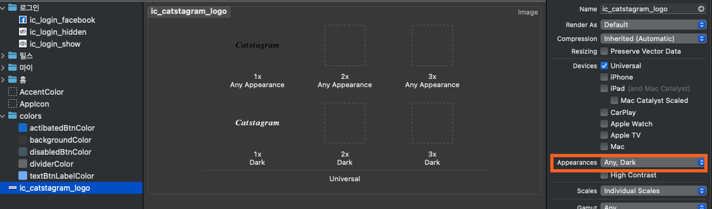
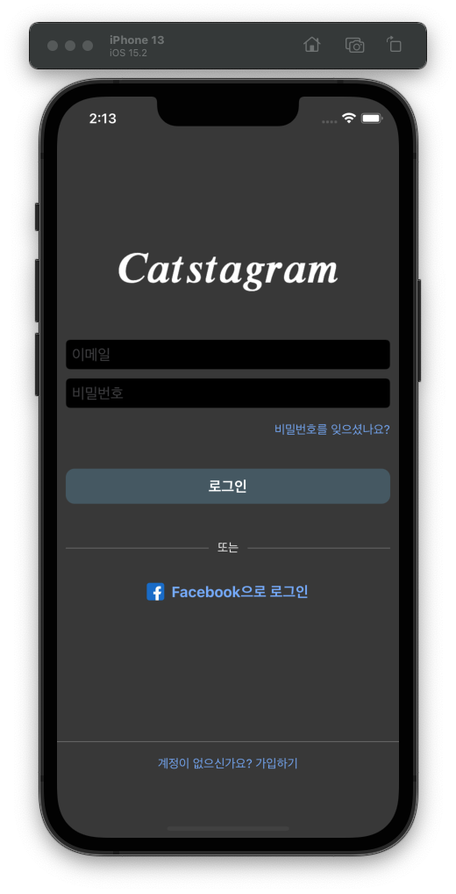
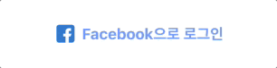

## Week 04 - 홈 화면 구성

SwiftUI 대신 UIKit을 사용해보았습니다(스토리보드 X)  

### 사용 라이브러리  
```
  pod 'Then'
  pod 'SnapKit', '~> 5.0.0'

  pod 'RxSwift', '~> 5.1.1'
  pod 'RxCocoa', '~> 5.1.1'
```

#### SnapKit, Then
```swift
mainStackView.then {
    $0.axis = .vertical
    $0.distribution = .fill
    $0.alignment = .center
    $0.spacing = 30.0
}.snp.makeConstraints {
    $0.centerY.equalToSuperview()
    $0.leading.trailing.equalToSuperview()
}
```
위와 같이 이전 보다는 깔끔하게 뷰의 속성, 제약 지정

#### RxSwift, RxCocoa
비동기 프로그래밍을 관찰 가능하게 지원해주는 API  
코드가 간단해짐  

```swift
Observable.bind(to: Observer).disposed(by: disposeBag)
```
Observer가 Observable을 구독해서 이벤트 처리  
1. `subscribe`
2. `bind`: error 컨트롤 X
    - Observable을 구독하는 Observer가 늘 때마다 스트림도 같이 늘어남
3. `drive`: Main-Thread에서 동작
    - 스트림 공유 가능
    - UI 관련에서 활용하면 좋음

<br>

### Custom View
```swift
class CustomView:UIView {
    
    var customView = CustomView()
    var btn:UIButton?
    var passedJob: () -> Void = {}
    
    required init(btn: UIButton, job: @escaping () -> Void) {
        super.init(frame: .zero)
        self.btn = btn
        self.passedJob = job
        setup()
    }
    
    required init?(coder: NSCoder) {
        fatalError("should not be in storyboard")
    }
    
    func setup() {
        addSubview(customView)
        customView.snp.makeConstraints {
            $0.edges.equalToSuperview()
        }
        customView.backgroundColor = .gray

        customView.addSubView(btn)
        btn.snp.makeConstraints {
            $0.centerX.equalToSuperview()
            $0.centerY.equalToSuperview()
            $0.width.height.equalTo(100.0)
        }
        btn.addTarget(self, action: #selector(btnFunc(_:)), for: .touchUpInside)
    }
    
    @objc internal func btnFunc(_ sender: Any) {
        passedJob()
    }

}
```
자주 사용되는 커스텀 뷰의 경우 클래스로 만들어 사용할 수 있다.  
`init?(coder: NSCoder)`은 스토리보드에서 초기화를 할 때 부르는 함수이므로 `fatalError`로 지정했다.

#### @escaping
```swift
    required init(btn: UIButton, job: () -> Void) {
        super.init(frame: .zero)
        self.btn = btn
        self.passedJob = job    // error
        setup()
    }
```
매개변수인 클로저를 해당 함수안에서만 사용할 경우 `@escaping`이 필요 없지만, 저장해서 다른 데서도 써야할 경우 Escaping Closure를 사용해야 한다.

- non-escaping 클로저: 컴파일러가 클로저의 실행이 시작과 종료 시점을 알기 때문에, 클로저 내부 객체를 효율적으로 관리
- esacping 클로저: 함수 밖에서 실행되므로 클로저에서 사용하는 객체에 대한 추가적인 참조 싸이클을 관리  

컴파일러 퍼포먼스, 최적화에 차이가 있으므로 잘 쓰자

#### extension
```swift
extension UIButton {
    func setDefaultStyle() {
        self.layer.cornerRadius = CornerRadius.middle
        self.setTitleColor(.white, for: .normal)
        self.titleLabel?.font = UIFont.systemFont(ofSize: FontSize.middle, weight: UIFont.Weight.bold)
        self.setSpringAnimate()
    }
}
```
특정 클래스 뷰의 스타일 지정 정도만 필요한 경우 custom view를 만드는 것 보다는 extension을 사용하는 게 더 편한 것 같다

<br>

### 이미지 Asset 다크모드 설정

<p align="center">
</img>
</p>

`Assets`에서 해당 이미지를 선택하고, `Appearences`에서 `Any, Dark`를 체크하면 다크모드에서의 이미지를 따로 설정할 수 있다.  
Asset 자체에서 이미지 음영 반전하는 거는 못찾아서 따로 편집해서 넣어 줌

<p align="center">
</img>
</p>

### UIImage

#### Resizing
```swift
extension UIImage {
    
    func resizeTo(size: CGSize) -> UIImage? {
        return UIGraphicsImageRenderer(size: size).image { _ in
            draw(in: CGRect(origin: .zero, size: size))
        }
    }
    
    func resizeWithWidthAspectRatio(width: CGFloat) -> UIImage? {
        let ratio = self.size.width / self.size.height
        let size = CGSize(width: width, height: width / ratio)
        return resizeTo(size: size)
    }
    
    func resizeWithHeightAspectRatio(height: CGFloat) -> UIImage? {
        let ratio = self.size.width / self.size.height
        let size = CGSize(width: height * ratio, height: height)
        return resizeTo(size: size)
    }

}
```

#### Circle Crop
```swift

extension UIImage {

    var breadth:     CGFloat { min(size.width, size.height) }
    var breadthSize: CGSize  { .init(width: breadth, height: breadth) }
    var breadthRect: CGRect  { .init(origin: .zero, size: breadthSize) }
    
    func centerCrop() -> CGImage? {
        let originX:CGFloat = size.width > size.height ? ((size.width-size.height)/2).rounded(.down) : 0.0
        let originY:CGFloat = size.height > size.width ? ((size.height-size.width)/2).rounded(.down) : 0.0
        return self.cgImage?.cropping(to: .init(origin: .init(x: originX, y: originY), size: breadthSize))
    }
    
    func circleMasked() -> UIImage? {
        guard let cgImage = centerCrop() else { return nil }
        
        let format = imageRendererFormat
        format.opaque = false
        return UIGraphicsImageRenderer(size: breadthSize, format: format)
            .image {_ in
                UIBezierPath(ovalIn: breadthRect).addClip()
                UIImage(cgImage: cgImage, scale: format.scale, orientation: imageOrientation)
                    .draw(in: .init(origin: .zero, size: breadthSize))
            }
    }

}
```

<br>

### Animation
```swift
UIView.animate(withDuration: AnimateDuration.normal,
                delay: 0,
                usingSpringWithDamping: 0.5,
                initialSpringVelocity: 1.0,
                options: [.curveEaseInOut],
                animations: { someView.transform = someTransform },
                completion: nil
)
```
`usingSpringWithDamping`: 튕기는 정도, 0.0 ~ 1.0의 값, 0.0에 가까울 수록 튕기는 정도가 큼  
`initialSpringVelocity`: 튕기는 속도, 0.0 ~ 1.0의 값, 0.0에 가까울 수록 튕기는 속도가 빠름  

#### example: 버튼 애니메이션
```swift
extension UIButton {
    func setSpringAnimate() {
        addTarget(self, action: #selector(springAnimateDown), for: [.touchDown, .touchDragEnter])
        addTarget(self, action: #selector(springAnimateUp), for: [.touchDragExit, .touchCancel, .touchUpInside, .touchUpOutside])
    }
    
    @objc private func springAnimateDown(sender: UIButton) {
        springAnimate(sender, transform: CGAffineTransform.identity.scaledBy(x: 0.98, y: 0.98))
    }
    
    @objc private func springAnimateUp(sender: UIButton) {
        springAnimate(sender, transform: .identity)
    }
    
    private func springAnimate(_ button: UIButton, transform: CGAffineTransform) {
        UIView.animate(withDuration: AnimateDuration.normal,
                       delay: 0,
                       usingSpringWithDamping: 0.5,
                       initialSpringVelocity: 1.0,
                       options: [.curveEaseInOut],
                       animations: { button.transform = transform },
                       completion: nil
        )
    }
}
```
버튼을 눌렀을 때 버튼이 작아지고, 손을 뗐을 때 버튼이 원래 크기로 돌아온다.

<p align="center">
</img>
</p>

<br>

### RootViewController 바꾸기
```swift
extension UIWindow {
    
    func replaceRootViewController(_ newRootViewController: UIViewController, animated: Bool, completion: (() -> Void)?) {
        let snapshotImageView = UIImageView(image: self.snapshot())
        self.addSubview(snapshotImageView)

        let replacingCompletion = {
            self.rootViewController = newRootViewController
            self.bringSubviewToFront(snapshotImageView)
            if animated == true {
                UIView.animate(
                    withDuration: AnimateDuration.normal,
                    delay: 0, options: [.curveEaseInOut],
                    animations: {
                        snapshotImageView.transform = CGAffineTransform(translationX: -self.bounds.size.width, y: 0)
                    }, completion: {_ in
                        snapshotImageView.removeFromSuperview()
                        completion?()
                    }
                )
            } else {
                snapshotImageView.removeFromSuperview()
                completion?()
            }
        }

        if self.rootViewController!.presentedViewController != nil {
            self.rootViewController!.dismiss(animated: true, completion: replacingCompletion)
        } else {
            replacingCompletion()
        }
    }

    func snapshot() -> UIImage {
        UIGraphicsBeginImageContextWithOptions(bounds.size, false, UIScreen.main.scale)
        drawHierarchy(in: bounds, afterScreenUpdates: true)

        guard let result = UIGraphicsGetImageFromCurrentImageContext() else { return UIImage.init() }
        UIGraphicsEndImageContext()

        return result
    }
    
}
```
로그인하면 홈 화면이 `rootViewController`가 되어야 한다.  

이전 화면의 스냅샷을 찍고, 해당 스냅샷을 애니메이션으로 지우며 자연스럽게 이동할 수 있다.

<br>

### RxSwift로 Input Validation
```swift

import RxCocoa
import RxSwift

class LoginViewController: UIViewController {
    
    let disposeBag = DisposeBag()
    let viewModel = LoginViewModel()
    lazy var emailTextField = UITextField()
    lazy var passwordTextField = UITextField()
    lazy var loginBtn = UIButton()
    
    func setupBindings() {
        emailTextField.rx.text.bind(to: viewModel.emailSubject).disposed(by: disposeBag)
        passwordTextField.rx.text.bind(to: viewModel.passwordSubject).disposed(by: disposeBag)
        
        viewModel.isValidForm.bind {
            if $0 == true {
                self.loginBtn.setEnabled()
            }
            else {
                self.loginBtn.setDisabled()
            }
        }.disposed(by: disposeBag)
    }
    
}

class LoginViewModel {
    let emailSubject = BehaviorRelay<String?>(value: "")
    let passwordSubject = BehaviorRelay<String?>(value: "")
    
    let minPasswordCharacters = 8
    
    var isValidForm: Observable<Bool> {
        return Observable.combineLatest(emailSubject, passwordSubject) { email, password in
            guard email != nil && password != nil else { return false }
            return email!.isValidEmail() && password!.count >= self.minPasswordCharacters
        }
    }
}

```

<br>

### popViewController할 때 이전 화면에 데이터 전달(Delegate 사용)
```swift
protocol RegisterDelegate {
    func registerCompleted(userInfo: UserInfo)
}

class RegisterViewController: UIViewController {
    
    var delegate: RegisterDelegate?
    lazy var registerBtn = UIButton()
    
    @objc internal func backToLoginVC(_ sender: UIButton) {
        if sender == registerBtn {
            self.delegate?.registerCompleted(userInfo: UserInfo(email: emailTextField.text!, name: nameTextField.text!, nickName: nickNameTextField.text!, password: passwordTextField.text!))
        }
        self.navigationController?.popViewController(animated: true)
    }

}
```

```swift
class LoginViewController: UIViewController, RegisterDelegate {
    
    var userInfo:UserInfo?
    lazy var goToRegisterBtn = UIButton()
    
    @objc internal func goToRegisterVC(_ sender: Any) {
        let registerVC = RegisterViewController()
        registerVC.delegate = self
        self.navigationController?.pushViewController(registerVC, animated: true)
    }

    func registerCompleted(userInfo: UserInfo) {
        self.userInfo = userInfo
    }
}

```
0. 프로토콜 `RegisterDelegate` 정의
1. `LoginViewController`에서 프로토콜 `RegisterDelegate` 채택
2. `LoginViewController`에서 `RegisterViewController`의 `delegate`를 `self`로 지정 후 `pushViewController()`
3. `RegisterViewController`에서 `LoginViewController`로 리턴하기 전, `self.delegate?`의 함수 `registerCompleted(userInfo: UserInfo)` 호출
4. `RegisterViewController`에서 `popViewController()`
5. 프로토콜의 함수 `registerCompleted`를 `LoginViewController`에서 구현

### TableView

#### TableView 내부 버튼 클릭 가능하게 하기
```swift
class PostCell:UITableViewCell {
    override init(style: UITableViewCell.CellStyle, reuseIdentifier: String?) {
        super.init(style: style, reuseIdentifier: reuseIdentifier)

        contentView.addSubview(postCell)
        postCell.snp.makeConstraints {
            $0.edges.equalToSuperview()
        }
    }
}
```
**`contentView`** 에 `addSubview`를 해야 한다  

```swift
class MyTableView: UITableView {
    override func touchesShouldCancel(in view: UIView) -> Bool {
        if view is UIButton {
            return true
        }
        return super.touchesShouldCancel(in: view)
    }
}


tableView.delaysContentTouches = false
tableView.canCancelContentTouches = true
```
유저가 스크롤을 하는 것인지, 버튼을 클릭하는 것인지 처음 화면을 누르는 시점에는 알 수 없다  

따라서 일단 `delaysContentTouches`를 false로 하여 버튼을 누르면 바로 반응을 하게 하고, `canCancelContentTouches`를 true로 하여 스크롤이 가능하게 한다.  

또, `touchesShouldCancel`를 override하여 `UIButton`인 경우 터치를 취소하고 스크롤을 시행할 수 있게 한다. 

#### 기타
```swift
tableView.showsVerticalScrollIndicator = false  // 스크롤바 숨기기
tableView.separatorStyle = .none    // 구분선 삭제

cell.selectionStyle = .none     // 셀 선택 시 색 변하지 않게
```
