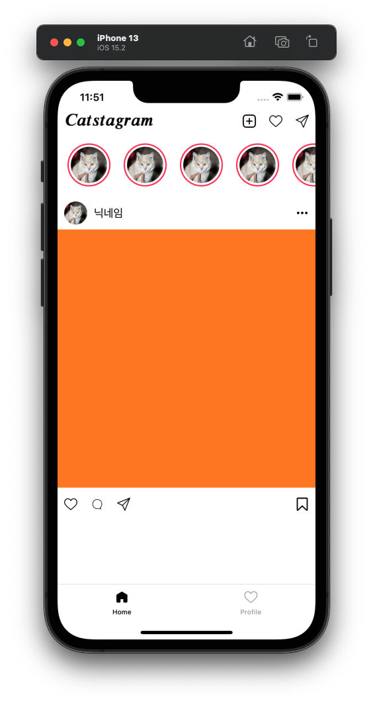
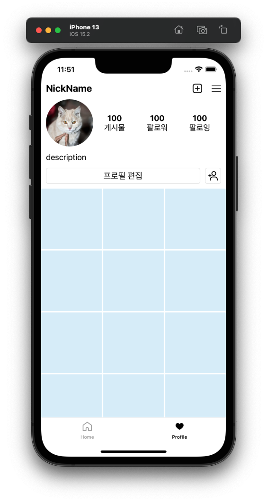
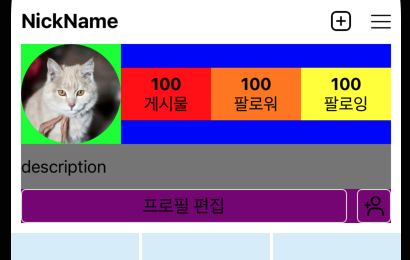

## Week 05 - 프로필 화면 구성

## Tabbar
```swift
class TabBarViewController: UITabBarController, UITabBarControllerDelegate {
    override func viewDidLoad() {
        super.viewDidLoad()
        
        self.delegate = self
    }
}
```
탭바를 다뤄줄 ViewController를 생성한다.

### UITabBarControllerDelegate
[document](https://developer.apple.com/documentation/uikit/uitabbarcontrollerdelegate)  
탭바 동작을 좀 더 커스텀화하는 등 추가할 사항이 있을 때 사용한다. 탭 선택 시의 행동, 전환 애니메이션 등을 위해 사용하는 선택 사항이다.  

### 탭바 배경색
[developer forums](https://developer.apple.com/forums/thread/682420)
> In iOS 15, UIKit has extended the usage of the scrollEdgeAppearance, which by default produces a transparent background, to all navigation bars.

iOS 15부터 UIKit의 탭바와 내비게이션바가 투명한 배경을 제공하게 확장되었다.  

그러나 기존처럼 사용하고 싶은 경우,
```swift
        if #available(iOS 15.0, *) {
            let appearance = UITabBarAppearance()
            appearance.configureWithOpaqueBackground()
            appearance.backgroundColor = Colors.backgroundColor
            self.tabBar.standardAppearance = appearance
            self.tabBar.scrollEdgeAppearance = tabBar.standardAppearance
        }
```
해당 코드로 `standartAppearance`를 설정해주면 된다.

### TabBarItem 추가
```swift
    let homeVC = HomeViewController()

    homeVC.tabBarItem = UITabBarItem(
        title: "Home",
        image: UIImage(named: "홈/ic_home_home_white")?.setSizeTabBarItem(),
        selectedImage: UIImage(named: "홈/ic_home_home_black")?.setSizeTabBarItem()
    )
```
이동할 ViewController에 `tabBarItem`을 지정해준다.  
선택되지 않았을 때와 선택되었을 때의 아이콘을 따로 설정하였다.

```swift
setViewControllers([vc1, vc2, vc3], animated: false)
```
탭바에 넣을 ViewController들을 `setViewControllers`로 설정해주면 된다.

### 결과

<p align="center">
</img>
</p>

<br>

## CollectionView

저번 주차 홈화면의 스토리 보여주기에서 간단하게 다뤘던 CollectionView를 프로필 화면에서 더 자세히 알아보도록 한다.

- **헤더 등 `SupplementaryView` 추가**
    1. 해당 `CollectionView`에 `register`해준다.
    2. `CollectionView` 관련 `delegate extension`에서
        - 헤더 크기를 지정한다.
        - `kind`에 따라 return 해준다.
- **셀 추가**
    1. 해당 `CollectionView`에 `register`해준다.
    2. `CollectionView` 관련 `delegate extension`에서
        - 셀 크기를 지정한다.
        - 개수를 지정한다.
        - `indexPath`에 따라 return 해준다.

### in viewDidLoad
```swift
    lazy var myCollectionView:MyCollectionView = {
        let flowLayout = UICollectionViewFlowLayout.init()
        flowLayout.scrollDirection = .vertical
        flowLayout.minimumInteritemSpacing = postSpacing
        flowLayout.minimumLineSpacing = postSpacing
        return MyCollectionView(frame: CGRect.zero, collectionViewLayout: flowLayout)
    }()
```
초기화할 때 `flowLayout`을 설정해줬다.  
스크롤 방향은 수직으로, 아이템끼리의 최소 간격은 지정해둔 상수로 한다.  
라인 간격도 지정한 상수와 동일하게 했다.  

```swift
        myCollectionView.delegate = self
        myCollectionView.dataSource = self
```
`delegate`와 `dataSource`를 `self`로 지정해준다.  

```swift
    myCollectionView.register(ProfileCell.classForCoder(), forSupplementaryViewOfKind: UICollectionView.elementKindSectionHeader, withReuseIdentifier: "ProfileCell")
        
    myCollectionView.register(MyPostCell.classForCoder(), forCellWithReuseIdentifier: "MyPostCell")
```
헤더에 자기 프로필 상세, 나머지 셀들은 포스트들을 넣어줄 것이므로 이를 등록해준다.  
`ProfileCell`은 헤더이므로 `forSupplementaryViewOfKind`를 `.elementKindSectionHeader`로 지정해준다.  
`MyPostCell`은 그냥 셀이므로 따로 `kind` 지정 없이 `identifier`만 등록해 줘도 된다.

### CollectionViewDelegate
```swift
extension ProfileViewController: UICollectionViewDelegate, UICollectionViewDataSource, UICollectionViewDelegateFlowLayout {
    
}
```
헤더와 각 셀 등에 대한 자세한 사항들은 `delegate` 내에서 지정해준다.

#### 헤더 크기 지정
```swift
    func collectionView(_ collectionView: UICollectionView, layout collectionViewLayout: UICollectionViewLayout, referenceSizeForHeaderInSection section: Int) -> CGSize {
        let width: CGFloat = collectionView.frame.width
        let height: CGFloat = collectionView.frame.height / 4.0
        return CGSize(width: width, height: height)
    }
```
헤더는 전체 높이의 4분의 1로 지정했다.  

#### 헤더 표시
```swift
    func collectionView(_ collectionView: UICollectionView, viewForSupplementaryElementOfKind kind: String, at indexPath: IndexPath) -> UICollectionReusableView {
        switch kind {
            case UICollectionView.elementKindSectionHeader:
                let headerView = collectionView.dequeueReusableSupplementaryView(ofKind: kind, withReuseIdentifier: "ProfileCell", for: indexPath) as! ProfileCell
                return headerView
            default: assert(false, "only header")
        }
    }
```
`header`, `footer` 등을 지정하는 `kind`가 매개변수로 온다.  
현재 `footer`는 필요 없으므로, switch문으로 `header`일 경우에만 지정한 셀을 리턴하게 했다.  

일반 셀은 `dequeueReusableCell`을 사용하지만, 헤더나 푸터 등 추가적인 정보를 나타내는 셀은 `dequeueReusableSupplementaryView`를 사용한다.  

#### 각 셀의 크기 지정
```swift
    func collectionView(_ collectionView: UICollectionView, layout collectionViewLayout: UICollectionViewLayout, sizeForItemAt indexPath: IndexPath) -> CGSize {
        let width = (collectionView.frame.width - postSpacing * 2) / 3.0
        return CGSize(width: width, height: width)
    }
```
3줄, 양 옆은 붙어 있고 가운데 2개의 space가 있게 할 것이므로, `collectionView`의 전체 `width`에서 `postSpacing`을 `2`번 뺀 것을 `3`등분했다.  

#### 셀 개수 지정
```swift
    func collectionView(_ collectionView: UICollectionView, numberOfItemsInSection section: Int) -> Int {
        return 30
    }
```
셀을 몇 개를 보여줄 지 정한다.  
무한 스크롤에서 어떻게 동작해야 하는 지는 다음에 알아봐야지  

#### 셀 표시
```swift
    func collectionView(_ collectionView: UICollectionView, cellForItemAt indexPath: IndexPath) -> UICollectionViewCell {
        let cell =  collectionView.dequeueReusableCell(withReuseIdentifier: "MyPostCell", for: indexPath) as! MyPostCell
        return cell
    }
```
`indexPath`에 따라 알맞게 셀을 보여준다.

### 결과

<p align="center">
</img>
</p>

#### ProfileCell 구성

<p align="center">
</img>
</p>

<br>
