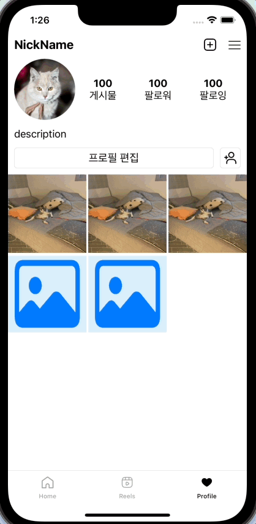

## Week 07 - 릴스 화면 구성, 탭 전환, Refresh

### Timer
```swift
    func startLoop() {
        timer = Timer.scheduledTimer(withTimeInterval: 2, repeats: true) { _ in
            self.moveNextPage()
            print(self.nowPage)
        }
    }
```
time interval과 반복 여부를 정하고, 그에 따른 동작도 정해서 타이머가 돌아가게 할 수 있다.  


## 탭 전환
```swift
    func startLoop() {
        timer = Timer.scheduledTimer(withTimeInterval: 2, repeats: true) { _ in
            self.moveNextPage()
            print(self.nowPage)
        }
    }
```
릴스 페이지에서 collectionView를 init할 때 타이머를 생성하고, 반복해서 돌아가게 했다.  
그런데 이렇게만 할 경우  

<p align="center">
</img>
</p>

탭 전환을 해도 계속 타이머가 돌아가고 있게 된다.

```swift
    func stopLoop() {
        timer?.invalidate()
        timer = nil
    }
```
따라서 타이머를 멈추는 함수를 지정하고,  
[UITabBarControllerDelegate](https://developer.apple.com/documentation/uikit/uitabbarcontrollerdelegate)를 사용해 탭이 전환될 때 타이머를 꺼주도록 한다.  

`didSelect item` 함수를 오버라이딩하면 사용자가 탭바 아이템을 눌러 화면이 전환될 때마다 그 현재 화면을 얻고 그에 따른 행동을 할 수 있다.  
```swift
    override func tabBar(_ tabBar: UITabBar, didSelect item: UITabBarItem) {
        switch item.title! {
        case "Home":
            print("now Home")
            let reelsViewController = self.viewControllers![1] as! ReelsViewController
            reelsViewController.stopLoop()
        case "Reels":
            print("now Reels")
            let reelsViewController = self.viewControllers![1] as! ReelsViewController
            reelsViewController.startLoop()
        case "Profile":
            print("now Profile")
            let reelsViewController = self.viewControllers![1] as! ReelsViewController
            reelsViewController.stopLoop()
        default:
            print("tabBar Error")
        }
    }
```
홈이나 프로필 페이지로 넘어갈 때는 릴스 페이지의 `stopLoop()`를 호출해서 타이머를 종료해 주었다.  
릴스 페이지로 넘어갈 때는 `startLoop()`를 호출해서 타이머를 시작해 주었다(collectionView를 init할 때 있던 `startLoop()`는 빼줌).

### 결과

<p align="center">
</img>
</p>
<br>

## 생명 주기
그런데 생각해 보니까 릴스 페이지의 타이머 끄고 켜기는 탭바에서 할 필요가 없다  

```
init
loadView
viewDidLoad
viewWillAppear
viewDidAppear
viewwillDisappear
viewDidDisappear
viewDidUnload
```
iOS 앱의 View Controller 생명 주기는 위와 같은데,  
탭바의 경우 한 번 페이지를 띄워 로드가 된 뒤부터는, 다른 페이지를 왔다 갔다 하면 (viewwillDisappear, viewDidDisappear)와 (viewWillAppear, viewDidAppear)를 반복하게 될 것이다.

```swift
// ReelsViewController.swift
    override func viewDidAppear(_ animated: Bool) {
        startLoop()
    }
    
    override func viewDidDisappear(_ animated: Bool) {
        stopLoop()
    }
```
따라서 릴스 뷰 컨트롤러에서 `viewDidAppear`에서 타이머를 시작해 주고, `viewDidDisappear`에서 타이머를 꺼주면 된다
<br>

## 화면 Refresh
현재 앱에서, 한 번 프로필 화면에 가서 데이터가 로드 된 후에는 홈 화면에 가서 포스트를 추가하고 오더라도 추가된 포스트를 확인할 수 없다.  
따라서 프로필 화면을 아래로 끌면 refresh 하는 동작을 추가한다.

```swift
private var refreshControl = UIRefreshControl()
```
[UIRefreshControl](https://developer.apple.com/documentation/uikit/uirefreshcontrol)로 쉽게 조작할 수 있다.  

```swift
extension ProfileViewController {
    private func setRefreshControl() {
        if #available(iOS 10.0, *) {
            myCollectionView.refreshControl = refreshControl
        }
        else {
            myCollectionView.addSubview(refreshControl)
        }
        refreshControl.tintColor = .black
        refreshControl.addTarget(self, action: #selector(refresh), for: .valueChanged)
    }

    @objc func refresh() {
        setUpData()
    }
    
    func refrechControlEnd() {
        DispatchQueue.main.async { self.refreshControl.endRefreshing() }
    }
}
```
collectionView에 `refreshControl`을 추가해주면 된다. iOS 10 이후부터는 `refreshControl`을 따로 설정할 수 있다.  

```swift
extension ProfileViewController {
    func successFeedAPI(_ result: UserFeedModel) {
        refrechControlEnd()
        userPosts = result.result?.getUserPosts
        myCollectionView.reloadData()
    }
}
```
데이터를 불러오는 작업이 끝난 경우 `refrechControlEnd()`를 호출해서 지워줬다.  

### 결과

<p align="center">
</img>
</p>

<br>
